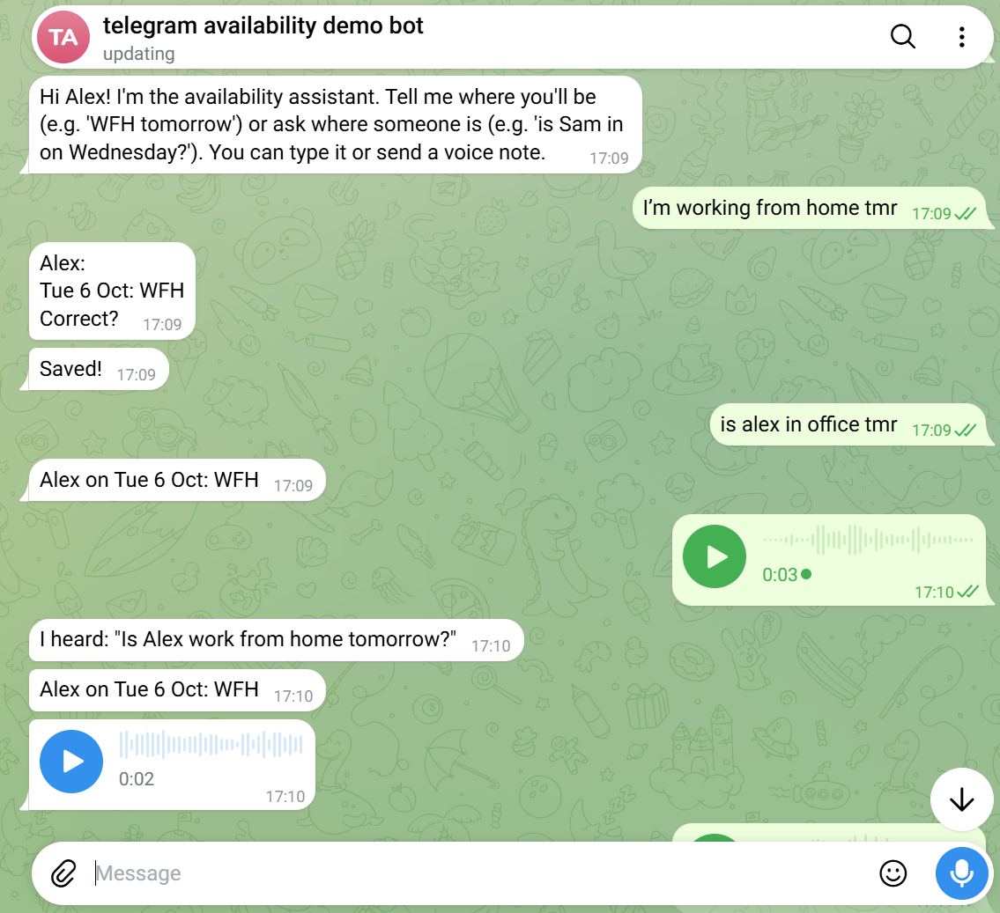
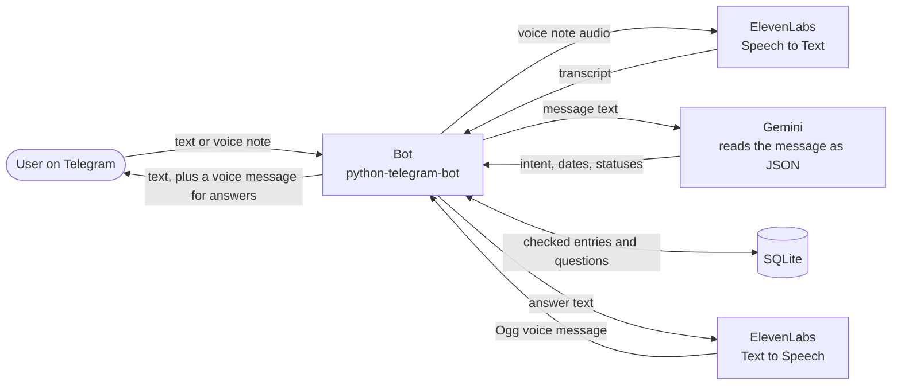

# Telegram Availability Assistant

A Telegram scheduling assistant, built in Python with Claude Code. People tell it where they will be (in the office, working from home, a half day, or on leave), a day or a whole week at a time, and ask it things like "who's in on Wednesday?". With ElevenLabs Speech to Text and Text to Speech, they can ask by voice note and hear the answer.



## Example conversation

Names and dates are dummy examples.

```
Alex:    wfh tomorrow
Bot:     Alex:
         Tue 6 Oct: WFH
         Correct?                         [Yes]  [No]
Alex:    (taps Yes)
Bot:     Saved!

Jordan:  (voice note) "Is Sam in the office on Wednesday?"
Bot:     I heard: "Is Sam in the office on Wednesday?"

         Sam on Wed 7 Oct: Office
Bot:     (voice message) "Sam on Wednesday 7 October: Office"

Jordan:  where is sam on thursday
Bot:     Nothing from Sam for Thu 8 Oct yet.      [Ask Sam to update]
```

## The problem

A small group kept asking each other who was in the office on which day, and the answers were scattered across chats. This puts them in one place that everyone can update, and ask, in plain language.

## The workflow questions

Connecting the APIs was the easy part. The harder questions were about the workflow:

- **When someone speaks, should the reply be voice, text or both?** For an answer, both. A question asked by voice note gets the answer in text, plus a spoken copy, so it works whether or not you press play. A question typed in gets text only.
- **If a voice note changes the schedule, the user still needs to read the change and confirm it before it is saved.** So an update never comes back as speech. It comes back as a written summary with Yes and No buttons, and nothing is saved until Yes. The reply also starts with what was heard, so a mishearing is obvious before anything changes.

I settled on **spoken answers for questions, and a written yes or no confirmation for updates.** The value comes from fitting the technology into how people actually use it.

## How it works



Gemini reads a message and returns structured data: telling or asking, who, which dates, which status. The code then checks every date and status. A question is answered straight from the database. An update is shown back with Yes/No buttons and saved only after Yes.

## Design decisions and trade-offs

- **Telegram.** Everyone already had it, and it supports buttons and voice notes. The trade-off is that a bot can't message someone who hasn't started a chat with it.
- **The AI only reads; the code decides.** Gemini never writes to the database, and answers come from the database, so the assistant can't invent where someone is. The cost is one extra tap to confirm an update.
- **Four statuses only:** office, WFH, half day, leave. That keeps reading messages reliable.
- **Gemini's free tier** for understanding messages. It costs nothing, with a limit of about 5 requests a minute.
- **Voice shares the text path.** A transcript is handled by exactly the same code as typed text, so voice adds no new rules.
- **Text always works.** If voice fails (no credits, no network), the text reply still arrives.
- **Dates are written out in full before speaking,** because a voice model reads "Fri 2 Oct" badly.
- **Free-plan limits.** The ElevenLabs free plan can't use library voices through the API, so this uses a built-in voice.
- **English only** for now.

## Evaluation

- **286 automated tests** with Gemini, Telegram and ElevenLabs faked, so they cost nothing to run.
- **Accuracy cases:** `tests/cases.json` has 24 realistic messages (typos, shorthand like "tmr", Singlish, half days, ranges, questions without a question mark, and messages with no day) with the expected result for each, run with `python -m tests.run_eval`. On 6 Oct 2026, with `gemini-3.1-flash-lite`, **all 24 pass**. An earlier prompt assumed "today" when a message had no day (a bare "wfh"); one added rule fixed it, checked with six new cases.

## What I'd do next

- An **ElevenLabs Agents phone line**, so you can call and ask.
- **Reminders** for people who haven't filled in their week.
- **Calendar sync.**
- **Always-on hosting.** It runs on a laptop today.
- More natural spoken answers, more languages, and a configurable timezone and holiday country.

## Setup (Windows)

Developed and tested on Python 3.14, Windows 11.

1. Download the code and open PowerShell in its folder.
2. Create a virtual environment **in a short path**, then install. (The ElevenLabs package has very long file names, which can break an install in a deeply nested folder.)
   ```powershell
   py -m venv C:\venvs\availability
   C:\venvs\availability\Scripts\python -m pip install -r requirements.txt
   ```
3. Make a Telegram bot with [@BotFather](https://t.me/BotFather) (`/newbot`), and get your own ID from [@userinfobot](https://t.me/userinfobot).
4. Get a free Gemini key at <https://aistudio.google.com/apikey>. For voice, also get an [ElevenLabs](https://elevenlabs.io) key and the ID of one of its built-in voices.
5. Create your two private files from the examples (both are in `.gitignore`), and fill them in:
   ```powershell
   Copy-Item .env.example .env
   Copy-Item users.example.json users.json
   ```
6. Run it, and try `wfh tomorrow`, a question, and a voice note:
   ```powershell
   C:\venvs\availability\Scripts\python bot.py
   ```
   Run the tests with `C:\venvs\availability\Scripts\python -m pytest`.

The code is in `bot.py` (Telegram), `llm.py` (Gemini), `voice.py` (ElevenLabs) and `db.py` (SQLite).

## Built with

Python, python-telegram-bot, the Gemini API, the ElevenLabs API, SQLite, pytest, and Claude Code.
